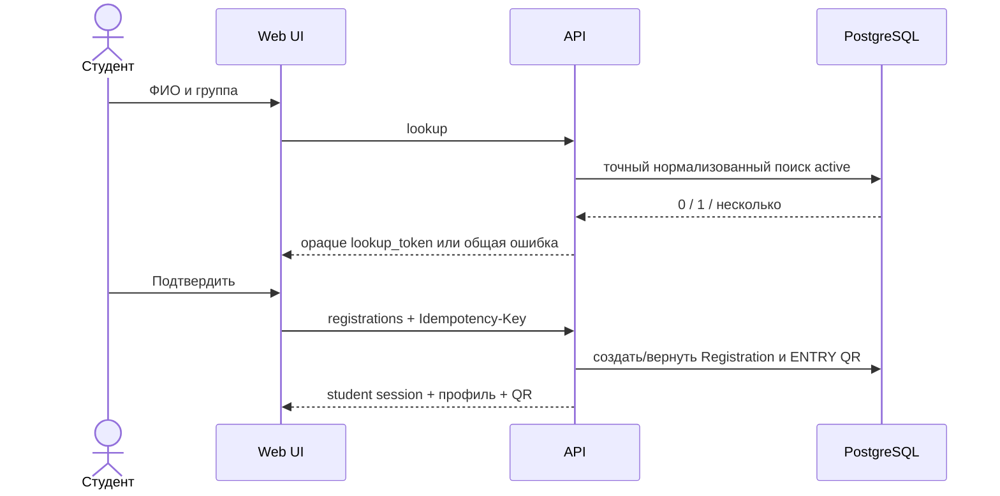
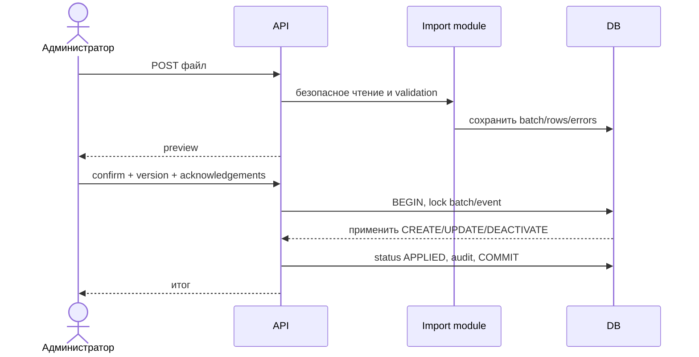
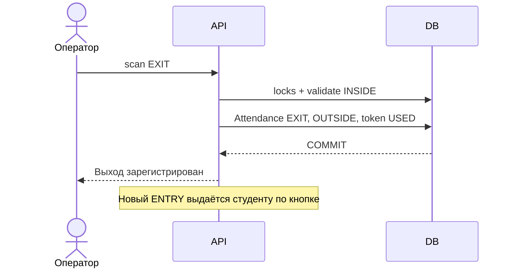
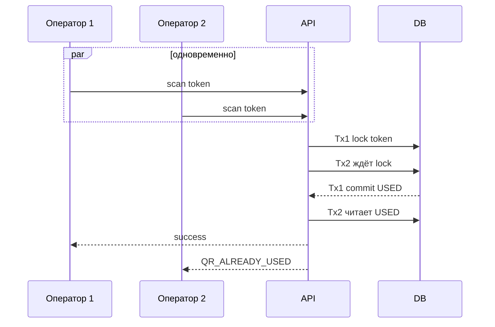

# Пользовательские сценарии

## Регистрация



`lookup_token` — краткоживущий подписанный непрозрачный результат однозначного поиска; клиент не получает ID до регистрации. При 0/нескольких совпадениях одинаковый по форме ответ и rate limit.

## Импорт и подтверждение



```mermaid
sequenceDiagram
  actor A as Администратор
  participant API
  participant DB
  A->>API: confirm(import_id, preview_version)
  API->>DB: SELECT batch FOR UPDATE
  alt READY и версия актуальна
    API->>DB: применить всё одной транзакцией
    API->>DB: APPLIED + AuditLog
    DB-->>API: COMMIT
  else уже APPLIED
    DB-->>API: тот же итог (идемпотентно)
  else конфликт/ошибка
    DB-->>API: ROLLBACK; FAILED/409
  end
```

## Вход, выход и гонка

```mermaid
sequenceDiagram
  actor O as Оператор
  participant API
  participant DB
  O->>API: scan ENTRY + Idempotency-Key
  API->>DB: BEGIN; token FOR UPDATE; registration FOR UPDATE
  API->>DB: Attendance ENTRY, INSIDE, token USED, новый EXIT
  DB-->>API: COMMIT
  API-->>O: Вход разрешён
```





Другие сценарии: камера запрещена → ручной ввод; сеть пропала до ответа → повтор с тем же `Idempotency-Key`; импорт с ERROR → скачать отчёт; WARNING → явный checkbox; событие архивировано → регистрация и scanning закрыты.

