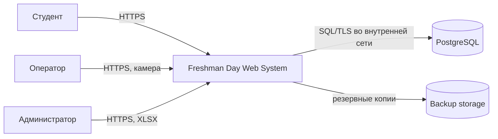
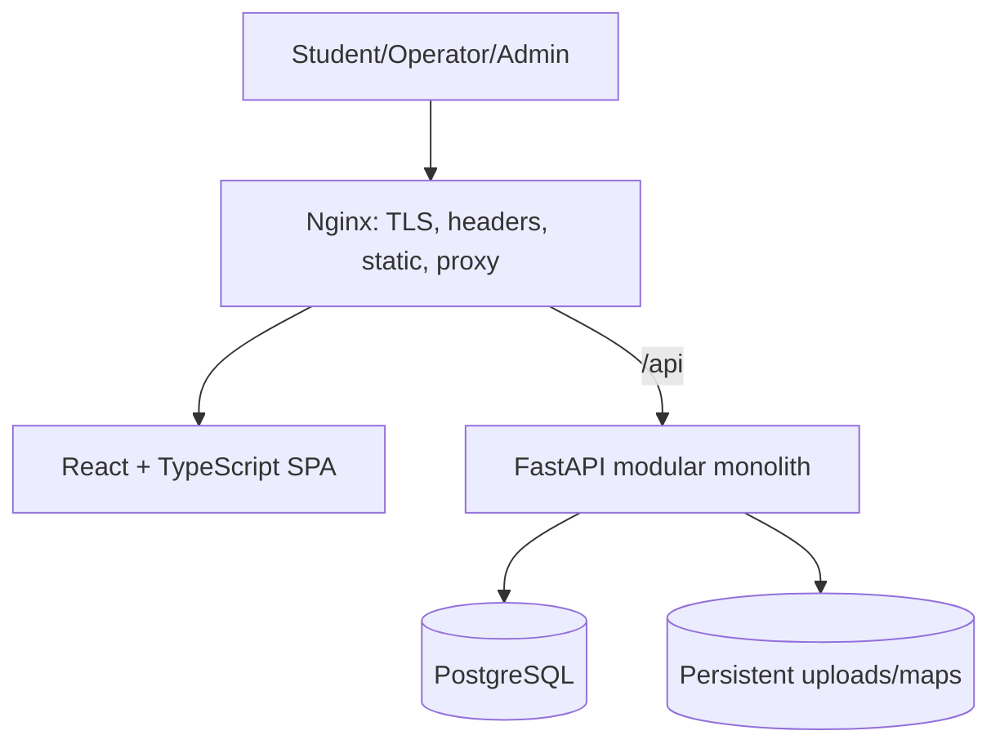
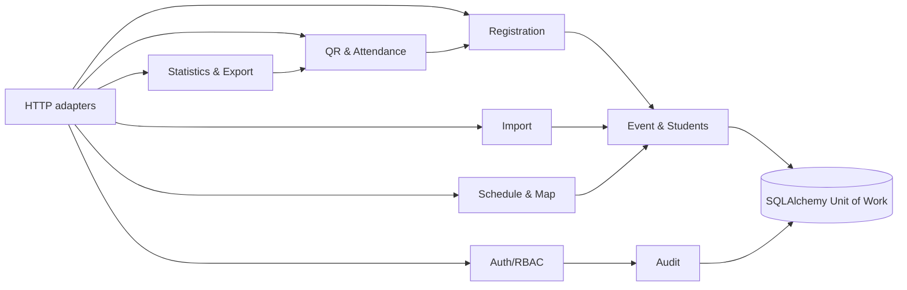

# Архитектура системы

## Контекст

## Контейнеры

В production frontend собирается в статические файлы. Backend stateless кроме БД/файлов; горизонтальное масштабирование возможно позднее. Загруженные оригиналы Excel по умолчанию удаляются после установленного срока, staging-данные остаются согласно политике.

## Модули backend

Модуль владеет моделями и сервисами; связи идут через application interfaces — прикладные интерфейсы. API → application → domain → infrastructure. Транзакция задаётся use case — прикладным сценарием, не репозиторием.

## Технологические решения

FastAPI/SQLAlchemy 2/Alembic/PostgreSQL и React/Vite/TanStack Query соответствуют команде и нагрузке. Добавляются только `openpyxl` в read-only режиме с защитой ZIP, библиотека QR-кодирования, `argon2id` для паролей и структурированные логи. Redis/Kafka/Kubernetes/WebSocket не нужны: фоновые задачи импорта допустимы в процессе при одном экземпляре MVP; перед масштабированием нужен DB-backed worker.

