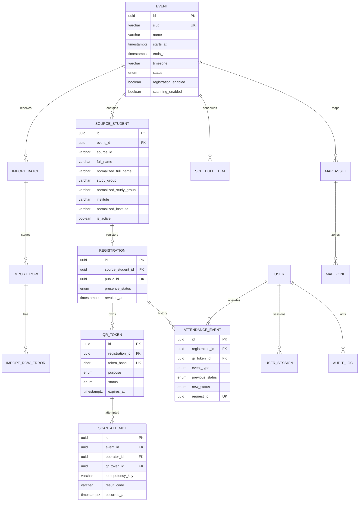
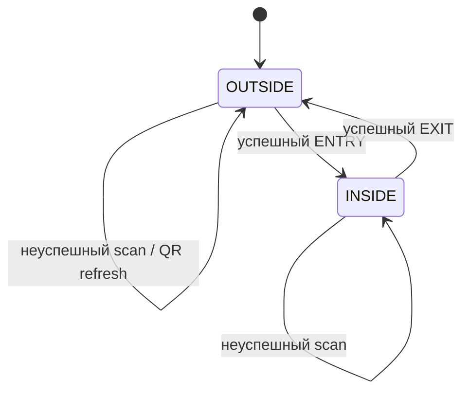

# Проектирование базы данных

Все PK — UUIDv7 (на уровне приложения до штатной поддержки БД), timestamps — `timestamptz`, enum — PostgreSQL enum либо CHECK с миграцией. Строки ограничены по длине. `source_id varchar(128)` сохраняет ведущие нули и будущие префиксы.

## Ограничения и индексы

- `source_students UNIQUE(event_id, source_id)` — ключ синхронизации.
- Индекс `(event_id, normalized_full_name, normalized_study_group) WHERE is_active` — регистрационный поиск; институт исключён намеренно.
- `(event_id, normalized_study_group)`, `(event_id, normalized_institute)` — фильтры/группировки. Отдельный `(event_id,is_active)` не нужен при низкой селективности; частичный `WHERE is_active` добавляется после измерений.
- `registrations UNIQUE(event_id, source_student_id)` и CHECK согласованности статуса.
- Частичный unique `qr_tokens(registration_id) WHERE status='ACTIVE'`; unique `token_hash`.
- `attendance_events UNIQUE(qr_token_id)`, `UNIQUE(event_id, request_id)`; индекс `(event_id, occurred_at)`.
- `scan_attempts UNIQUE(operator_id, idempotency_key)`; индекс recent `(operator_id, occurred_at DESC)`.
- `import_rows UNIQUE(import_batch_id,row_number)`; batch `(event_id,created_at DESC)`.
- Нормализованные институты остаются строками: отдельный справочник преждевременен без утверждённого mapping. `StudyGroup` также не выделяется; это атрибут снимка источника.

Удаление предметных данных запрещено обычным API. SourceStudent деактивируется; Registration отзывается; Event архивируется. Изменение imported полей возможно импортом, ручной PATCH пишет AuditLog и метку override (требует уточнения политики следующего импорта).

## Состояния

