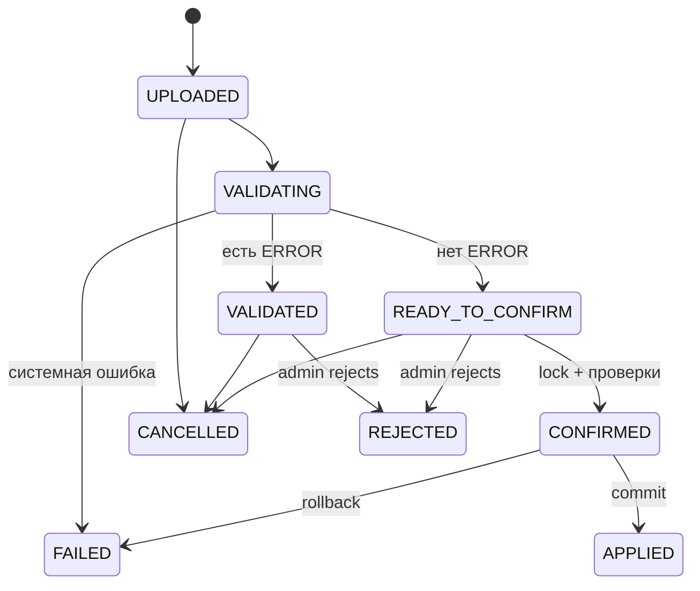

# Проектирование импорта

## Решение

Стратегия C: CREATE/UPDATE/UNCHANGED и явная DEACTIVATE. Загрузка никогда не меняет `SourceStudent`. Staging хранит исходные и нормализованные значения, action, ошибки и preview version. Оригинал шифруется на диске и удаляется по retention policy.

## Pipeline

1. Stream upload с лимитом 20 MiB; вычислить SHA-256, безопасное имя генерирует сервер.
2. Проверить `.xlsx`, MIME/ZIP-сигнатуру, число/суммарный размер ZIP entries, compression ratio, отсутствие путей/макросов/external links.
3. Открыть `openpyxl(read_only=True,data_only=False)`; первый непустой лист; ≤50k data rows.
4. Заголовки trim+lower должны ровно включать `id,name,group,institute`; extras игнорировать с WARNING.
5. Ячейки-формулы (`data_type='f'` или начало `=,+,-,@` в опасном контексте) отклонить. Числовой `id` принять только целый положительный и канонизировать в decimal string; строковый — trim, 1..128, разрешён безопасный printable Unicode.
6. Нормализовать по BR-02, не теряя raw; пустые/controls/limits → ERROR; regex группы → WARNING.
7. Дубликат `source_id` отмечает все строки ERROR; duplicate person при разных ID — WARNING.
8. Сопоставить только `(event_id,source_id)`; вычислить diff и набор отсутствующих active.
9. Сохранить preview/counters, status `READY_TO_CONFIRM` если ERROR=0, иначе `VALIDATED`.
10. Confirm проверяет batch/version/warnings/deactivations; блокирует batch и Event import lock; в одной транзакции применяет upsert и deactivate, отзывает QR деактивированных, пишет audit, `APPLIED`.

## Атомарность и повторы

`SELECT ImportBatch FOR UPDATE`; только READY допустим. Повтор с тем же key после APPLIED возвращает сохранённый итог; другой key получает 409. Preview version включает hash текущего event student snapshot; если с момента validation применён другой импорт, требуется revalidate. Внешний статус FAILED фиксируется отдельной короткой транзакцией после rollback бизнес-транзакции.

Отчёт ошибок: `row_number,id,name,group,institute,error_code,error_message`; каждая экспортируемая строка с `= + - @` получает безопасный префикс `'` и тип string.

