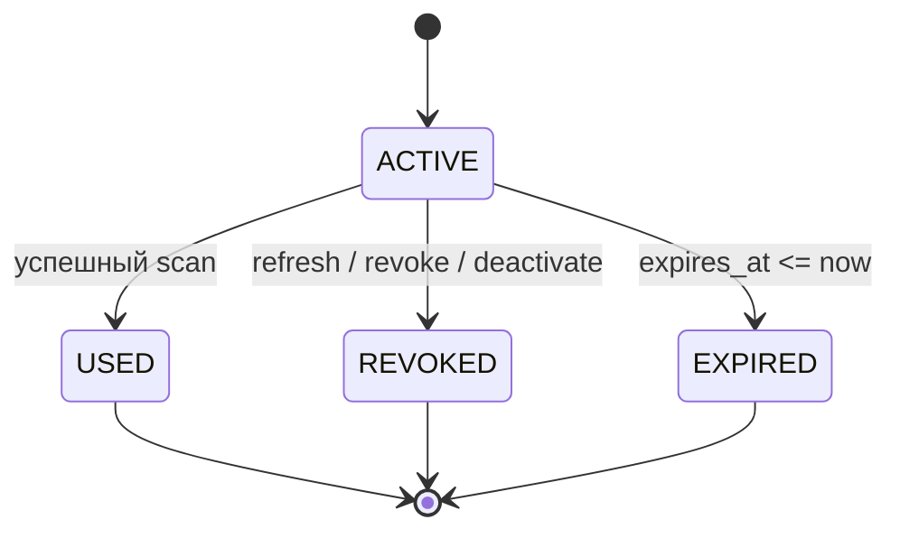

# QR и посещаемость

Токен генерируется CSPRNG (32 bytes, base64url). QR содержит URL `/q/<token>` без ПДн; backend вычисляет `HMAC-SHA-256(pepper,token)`, сравнивает constant-time. Pepper хранится как secret, токен в логах/analytics/referrer запрещён. URL обрабатывается операторским UI локально и отправляется POST body.

Транзакция scan: найти hash; `FOR UPDATE` token, затем registration в фиксированном порядке; проверить event/scanning/user scope/ACTIVE/expiry/purpose/presence; создать ScanAttempt и AttendanceEvent; обновить registration/token; при ENTRY создать EXIT token; commit. Бизнес-отказ также пишет ScanAttempt отдельным безопасным способом, не раскрывая токен. Неизвестный и поддельный токен возвращают одинаковый `QR_INVALID`.

Повторы: `(operator_id,idempotency_key)` уникален и хранит fingerprint body + status/response. Тот же key+body возвращает ответ, key с другим body → 409. Два разных keys сериализуются row lock; проигравший → `QR_ALREADY_USED`, второго AttendanceEvent нет.

Передача screenshot полностью не предотвращается; срок 15 минут, одноразовость, видимое назначение/таймер, проверка оператором показанных ФИО/группы и возможность revoke снижают риск.

